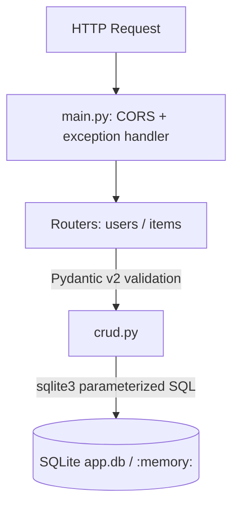

# fastapi-starter-kit

[](https://github.com/donny-devops/fastapi-starter-kit/actions/workflows/ci.yml)
[](https://www.python.org/downloads/)
[](https://github.com/astral-sh/ruff)
[](LICENSE)

A production-ready FastAPI starter with SQLite (`sqlite3`), full CRUD for users
and items, optional GitHub session OAuth, Pydantic v2 schemas, CORS, structured
logging, dotenv config, a pytest suite, Docker support, and an optional
Cloudflare Worker/D1 edge shim. CRUD is open by default; JWT is not included.

---

## Contents

- [Architecture](#architecture)
- [Project structure](#project-structure)
- [Local setup](#local-setup)
- [Docker setup](#docker-setup)
- [Environment variables](#environment-variables)
- [API reference](#api-reference)
- [Running tests](#running-tests)
- [Contributing](#contributing)

---

## Architecture



Each HTTP request passes through the following layers:

```
HTTP request
     │
     ▼
 main.py ── CORS middleware
     │   └─ global exception handler (→ 500 JSON)
     ▼
 Router  ── Pydantic input validation (→ 422 on failure)
     │       routers/users.py  |  routers/items.py
     ▼
 crud.py ── sqlite3 parameterized queries
     │
     ▼
 SQLite  ── app.db (file) or :memory: (tests)
```

**Key design decisions:**

- **sqlite3, no ORM** — persistence uses the Python standard library. Schema
  lives in `database.py`; queries in `crud.py` are parameterized (`?` placeholders).
- **Flat module layout** — `config`, `database`, `schemas`, and `crud`
  are top-level modules; routers live in `routers/`. No unnecessary nesting.
- **Dependency injection** — `get_db` is a FastAPI dependency that yields a
  `sqlite3.Connection`. Tests override it with a shared in-memory database.
- **No ORM objects in responses** — handlers return dicts that FastAPI validates
  against Pydantic response models.
- **Cascade deletes** — deleting a `User` deletes their `Item` rows via
  `ON DELETE CASCADE` (foreign keys are enabled with `PRAGMA foreign_keys = ON`).
- **Isolate mesh controls** — L1 LRU cache and a 50k req/min limiter sit on the
  origin. Eight-PoP throughput figures in `/ops/status` are a configured catalog,
  not live Cloudflare Analytics.
- **Optional GitHub OAuth** — session cookies after `/auth/login/github`.
  `/users` and `/items` stay unauthenticated unless you add an auth layer later.

---

## Project structure

```
fastapi-starter-kit/
├── main.py              # App entry: CORS, logging, routers, error handler
├── config.py            # Env config (python-dotenv)
├── database.py          # sqlite3 connect, schema, get_db
├── schemas.py           # Pydantic schemas: Create / Update / Response
├── crud.py              # Parameterized SQL for users and items
├── cache.py             # In-isolate L1 LRU (TTL)
├── rate_limit.py        # Per-client sliding window
├── mesh.py              # PoP / tenant / LLM failover catalog
├── wrangler.toml        # Cloudflare Worker + D1 bindings
├── cloudflare/
│   ├── worker.js        # Edge proxy + geo shard headers
│   └── migrations/      # D1 SQL (same schema as sqlite3)
├── routers/
│   ├── users.py         # /users endpoints
│   ├── items.py         # /items endpoints
│   ├── auth_github.py   # optional GitHub OAuth + /auth/me
│   └── ops.py           # /ops mesh catalog endpoints
├── tests/
│   ├── conftest.py      # Fixtures: in-memory DB, client, seeded data
│   ├── test_health.py
│   ├── test_users.py
│   ├── test_items.py
│   ├── test_database.py
│   ├── test_ops.py
│   └── test_auth_github.py
├── .env.example         # Copy to .env before first run
├── .github/
│   └── workflows/
│       └── ci.yml       # CI: ruff lint+format, pytest, Docker build
├── Dockerfile
├── docker-compose.yml
├── pytest.ini
└── requirements.txt
```

---

## Local setup

**Requirements:** Python 3.12+

```bash
# 1. Create and activate a virtual environment
python -m venv .venv
source .venv/bin/activate        # Windows: .venv\Scripts\activate

# 2. Install dependencies
pip install -r requirements.txt

# 3. Configure environment
cp .env.example .env             # edit values as needed

# 4. Start the dev server (auto-reload on file changes)
uvicorn main:app --reload
```

The server starts at `http://localhost:8000`. The SQLite database (`app.db`) is
created automatically on the first request.

Interactive docs:

| URL | Interface |
|-----|-----------|
| `http://localhost:8000/docs` | Swagger UI |
| `http://localhost:8000/redoc` | ReDoc |

---

## Docker setup

**Requirements:** Docker 24+ with the Compose plugin

```bash
# Optional: copy and edit env (Compose starts without a .env file)
cp .env.example .env

# Build and start
docker compose up --build

# Stop and remove containers (data volume is preserved)
docker compose down
```

The app is available at `http://localhost:8000`. The SQLite database is stored in
a named Docker volume (`db-data`) mounted at `/app/data` inside the container, so
data persists across container restarts and rebuilds.

To wipe the database volume:

```bash
docker compose down -v
```

**Healthcheck** — Docker polls `GET /ready` every 30 s (3 retries, 10 s start
period). The container is marked `healthy` once sqlite3 answers `SELECT 1`.

---

## Environment variables

Copy `.env.example` to `.env` and adjust as needed. All variables have defaults
so the app starts without a `.env` file.

| Variable | Default | Description |
|----------|---------|-------------|
| `APP_ENV` | `development` | `development` / `test` allow a fallback session secret; `production` requires `SECRET_KEY` |
| `SECRET_KEY` | _(dev fallback)_ | Session signing key. Required when `APP_ENV=production` |
| `SESSION_HTTPS_ONLY` | `true` in production | Set the session cookie `Secure` flag |
| `SESSION_SAME_SITE` | `lax` | Session cookie SameSite: `lax`, `strict`, or `none` |
| `SQLITE_PATH` | `./app.db` | Filesystem path to the SQLite database file |
| `DATABASE_URL` | _(unset)_ | Optional alias; `sqlite:///./app.db` is mapped to a file path |
| `ALLOWED_ORIGINS` | `http://localhost:3000` | Comma-separated list of CORS origins |
| `RATE_LIMIT_PER_MINUTE` | `50000` | Isolate rate limit per client IP (or `CF-Connecting-IP`) |
| `L1_CACHE_MAXSIZE` | `4096` | In-process LRU entries for GET `/users/{id}` and `/items/{id}` |
| `L1_CACHE_TTL_SECONDS` | `30` | L1 cache TTL |
| `LOG_LEVEL` | `INFO` | Logging verbosity: `DEBUG` `INFO` `WARNING` `ERROR` |
| `GITHUB_CLIENT_ID` | _(empty)_ | GitHub OAuth app client ID (optional) |
| `GITHUB_CLIENT_SECRET` | _(empty)_ | GitHub OAuth app client secret (optional) |
| `GITHUB_REDIRECT_URI` | `http://localhost:8000/auth/github/callback` | OAuth callback URL |

---

## API reference

### Health

#### `GET /health`

Liveness. Does not touch the database.

```
HTTP/1.1 200 OK

{"status": "ok"}
```

#### `GET /ready`

Readiness. Runs `SELECT 1` against sqlite3.

```
HTTP/1.1 200 OK           → {"status": "ok"}
HTTP/1.1 503 Unavailable  → {"status": "unavailable"}
```

### GitHub OAuth

Optional. `/users` and `/items` do not require a session.

#### `GET /auth/login/github`

Redirects to GitHub. Returns `500` if `GITHUB_CLIENT_ID` is unset.

#### `GET /auth/github/callback`

Exchanges `code` after validating `state`. Stores a small `github_user` profile
in the session. Does not return the GitHub access token.

#### `GET /auth/me`

```
HTTP/1.1 200 OK           → github_user object
HTTP/1.1 401 Unauthorized → {"detail": "Not authenticated"}
```

#### `GET /auth/logout`

```
HTTP/1.1 200 OK

{"status": "logged out"}
```

#### `GET /ops/status`

Isolate cache/rate-limit stats plus the configured 8-shard topology. Topology
figures are catalog values, not live Cloudflare Analytics.

#### `GET /ops/route?country=JP`

Maps ISO country code to D1 shard / colo (`JP` → `shard_apac_01` / `NRT`).
Unknown countries fall back to `shard_amer_01`.

---

### Users

#### `GET /users/`

Returns a paginated list of users.

| Query param | Default | Description |
|-------------|---------|-------------|
| `skip` | `0` | Records to skip |
| `limit` | `100` | Max records to return |

```
HTTP/1.1 200 OK

[
  {
    "id": 1,
    "name": "Alice",
    "email": "alice@example.com",
    "is_active": true,
    "created_at": "2026-04-10T12:00:00Z"
  }
]
```

#### `GET /users/{id}`

```
HTTP/1.1 200 OK        → user object
HTTP/1.1 404 Not Found → {"detail": "User not found"}
```

#### `POST /users/`

```json
{"name": "Alice", "email": "alice@example.com"}
```

```
HTTP/1.1 201 Created   → user object
HTTP/1.1 409 Conflict  → {"detail": "Email already registered"}
HTTP/1.1 422           → validation error detail
```

#### `PUT /users/{id}`

All fields are optional. Only supplied fields are updated.

```json
{"name": "Alicia", "email": "alicia@example.com", "is_active": false}
```

```
HTTP/1.1 200 OK        → updated user object
HTTP/1.1 404 Not Found → {"detail": "User not found"}
```

#### `DELETE /users/{id}`

Cascades — also deletes all items owned by this user.

```
HTTP/1.1 204 No Content
HTTP/1.1 404 Not Found → {"detail": "User not found"}
```

---

### Items

#### `GET /items/`

| Query param | Default | Description |
|-------------|---------|-------------|
| `skip` | `0` | Records to skip |
| `limit` | `100` | Max records to return |

```
HTTP/1.1 200 OK

[
  {
    "id": 1,
    "title": "Widget",
    "description": "A fine widget",
    "owner_id": 1
  }
]
```

#### `GET /items/{id}`

```
HTTP/1.1 200 OK        → item object
HTTP/1.1 404 Not Found → {"detail": "Item not found"}
```

#### `POST /items/`

`owner_id` must reference an existing user.

```json
{"title": "Widget", "description": "A fine widget", "owner_id": 1}
```

```
HTTP/1.1 201 Created   → item object
HTTP/1.1 404 Not Found → {"detail": "Owner user not found"}
HTTP/1.1 422           → validation error detail
```

#### `PUT /items/{id}`

All fields are optional. Pass `"description": null` to clear it.

```json
{"title": "Updated Widget", "description": null}
```

```
HTTP/1.1 200 OK        → updated item object
HTTP/1.1 404 Not Found → {"detail": "Item not found"}
```

#### `DELETE /items/{id}`

Does not affect the owning user.

```
HTTP/1.1 204 No Content
HTTP/1.1 404 Not Found → {"detail": "Item not found"}
```

---

## Running tests

```bash
pytest -v
```

The test suite uses a shared in-memory SQLite database (`sqlite3` URI
`mode=memory&cache=shared`) and `httpx.AsyncClient` — no running server or
external services required. Each test function starts with a clean database.

```bash
pytest -v -k "TestCreateUser"    # run a single class
pytest -v --tb=short             # compact tracebacks
```

To run lint and format checks locally (same checks as CI):

```bash
ruff check .
ruff format --check .
```

---

## Contributing

See [CONTRIBUTING.md](CONTRIBUTING.md) for the development workflow, code style
guide, and pull request process.

For security issues, see [SECURITY.md](SECURITY.md).
